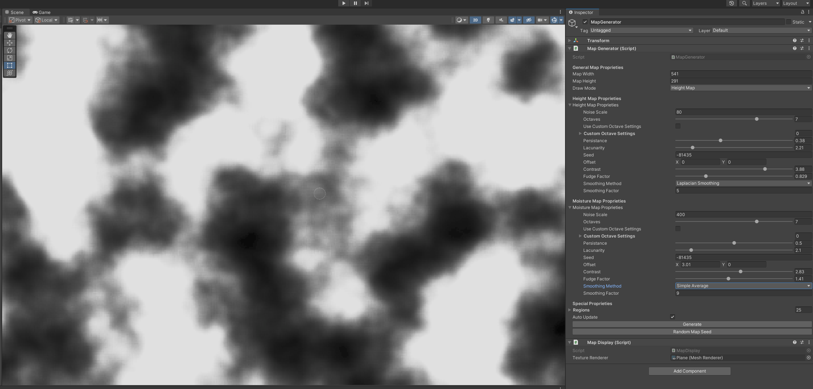
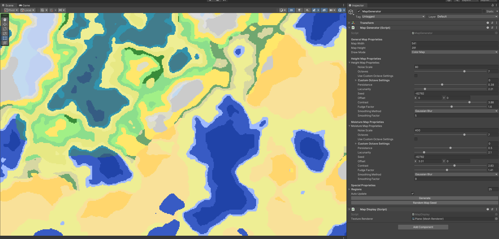

# 2D World Biome Generator

A Unity-based application that generates 2D world biomes using Perlin noise and various blurring algorithms like Gaussian. The app creates realistic, diverse terrains that can be used as biomes in games or simulations.

## Features
- **Perlin Noise**: Generates smooth, natural-looking random terrain.
- **Biome Generation**: Creates distinct biomes (e.g., forests, deserts, mountains) based on noise values.
- **Blurring Algorithms**: Applies Gaussian and other blurring techniques to smooth out the generated terrain, enhancing visual appeal.
- **Customizable Parameters**: Allows tweaking of noise and blur parameters for different terrain types and effects.
- **Unity Integration**: Developed in Unity using C#, compatible with Unity’s environment for easy integration into projects.

## Technologies Used
- **Unity**: Game engine used to create and render the 2D biomes.
- **C#**: Programming language used for scripting terrain generation logic and algorithm implementation.
- **Perlin Noise**: Core algorithm for generating realistic terrain patterns.
- **Gaussian Blur**: Blurring technique used to smooth the generated terrain and biomes.

## Screenshots

*Example of the height map from a generated biome.*

*Example of generated biome.*
